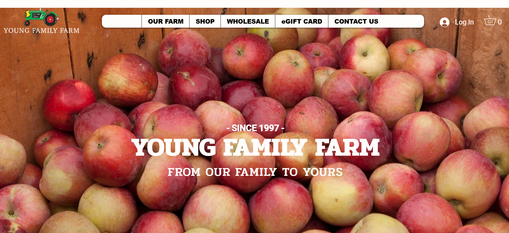
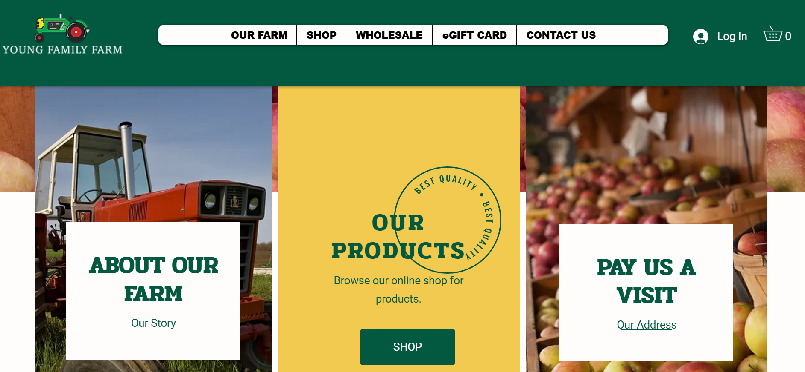
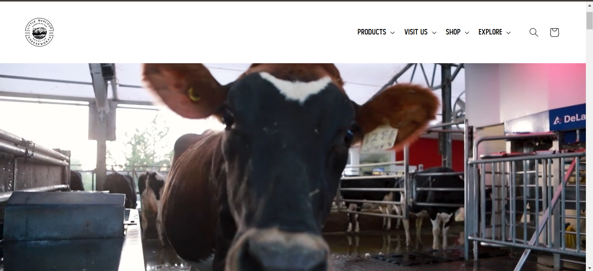
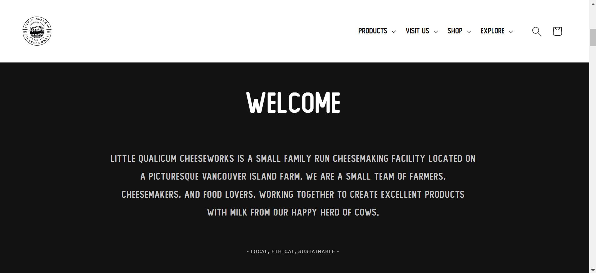
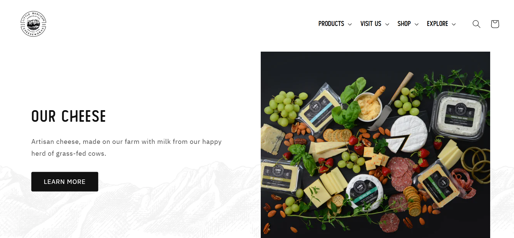

# Project Part One

## Project Summary

I have chosen to use [Kehler's Vegetable Company Farm
Market](https://www.kehlervegetables.ca/)

- The most important purpose of the site is to advertise the farm and bring customers to their farmstand.

- The target audience would be people who like to buy their produce locally, fresh, non GMO, and organically (though not yet certified organic).

- The overall message would be to make people aware of what the farm grows and where they are able to purchase items. Following the business via instagram and facebook is encouraged to keep up with hours, current stock, and anything in the process of growing.
  - We want the audience/customers to look at the site and either visit the location to purchase items, or to contact the business for any questions or wholesale inquiries.

* The current site is not appropriate due to: design(contrast, images not loading, colour scheme), The lighthouse analysis, wave accessbility, and pingdom tests were all very poor results so there is a lot to improve on.

## Look and Feel

- Mood: the visual moods the site should convey?

  - Calm and approachable. The site theme should match the business itself, so for a farm company there should be a modern and almost casual feeling to it, a sense of nature kind of.

- Inspiration: 2 homepage screenshots and urls of website designs that communicate similar moods to your idea-

  - The young family farm doesn't really have the same kind of colour scheme that I was thinking of, but it does have a similar approachable vibe with images that match both the products and the theme.
    <https://www.youngfamilyfarm.com/>

  
  

  - Little Qualicum Cheeseworks is much cleaner and more minimilistic than the previous website design, and fit a bit more with calming, layout as it is uncluttered and simple. I am hopefully aiming for a happy medium between the two sites.
    <https://cheeseworks.ca/>

  
  
  

- Colours: The original website is mostly black and white with images used as the background. There is a green in the logo however that we can use as well.

  1. #5C8039 is the colour of the logo.
  2. #3E5426 will be used for the main text.
  3. #3E6990 will be used as the highlighting contrast colour.
  4. #ffffff will be the neutral background.

- Images: we can use the logo, and the main background image from the homepage, as well as the images from the about, and contact pages.

- Fonts: Old standard tt will be used for the headers, and then oxygen for the body.

## Website Content:

### 1. Homepage

##### 1. Header

- Logo

- Navigation

  - Home
  - Contact
  - About

- Background Image

##### 2. Hero

- Heading

- Image

- Short Summary

##### 3. About

- Heading

- Paragraph detailing who the company is and what they do

- Image

- Link to about page

##### 4. Check Us Out

- Heading

- Location

- Paragraph

- List of social media images

##### 5. Contact

- Heading

- Contact Form

- Link to contact page

##### 6. Footer

- Heading

- Navigation: home, about, contact

- Address: street address, number, email, social media

- Disclaimer

- Copyright notice

### 2. About Us Page

##### 1. Header

- Same as the home page: logo, navigation, background image

##### 2. Hero

- Heading

- Current Hours table

- Image

##### 3. Who we are section

- Heading

- Paragraph

- Video

##### 4. Footer

- Same content as homepage footer

### 3. Contact Us Page

##### 1. Header

- Same as the previous pages

##### 2. Hero

- Heading

- Paragraph detailing location and ways to contact the business

- Map Embed

##### 3. Contact section

- Heading

- Background Image

- Contact form

##### 4. Footer

- Same as the previous pages footer.
